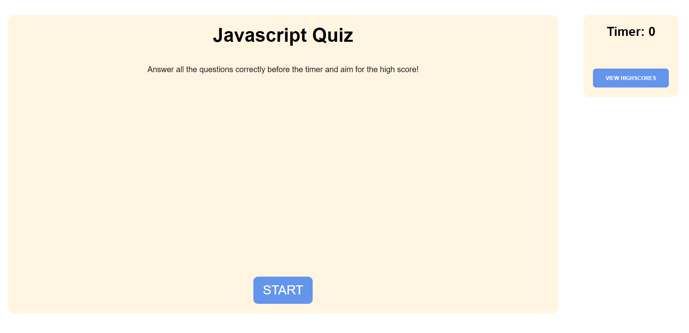

# Javascript-Coding-Quiz

## Description

This site is a quiz designed to test your knowledge of javascript.

This site features a main menu, where users can decide to start the timed quiz or view high scores from previous attempts a user took the quiz. The high score menu also features the option to clear the leaderboard.

Once the user clicks on the "start quiz" button, the timer will start, beginning the quiz. A question and a list of answer choices will also be prompted. When the user selects an answer choice, then a small message prompt will appear below the quiz, letting the user know if the choice selected is correct or incorrect. When the answer choice is right, then 10 seconds will be added to the timer, but when the choice selected is wrong, the timer will go down by 5 seconds. If the timer runs out before the user can answer all the questions in time, then the end screen will appear, giving the user a score of 0. The score is represented by how much the user builds up. After selecting an answer choice, then the user will be prompted to the next question. When the user has answered all the questions, the end screen will appear, letting the user input at least 3 characters into the initials text box. When the user inputs initials, then the high score menu will appear, with the inputted initials appearing on the score list, alongside their score.

## Screenshot

## Deployed Link

https://cazthetraveler.github.io/Coding-Quiz/
